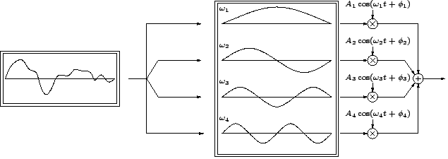
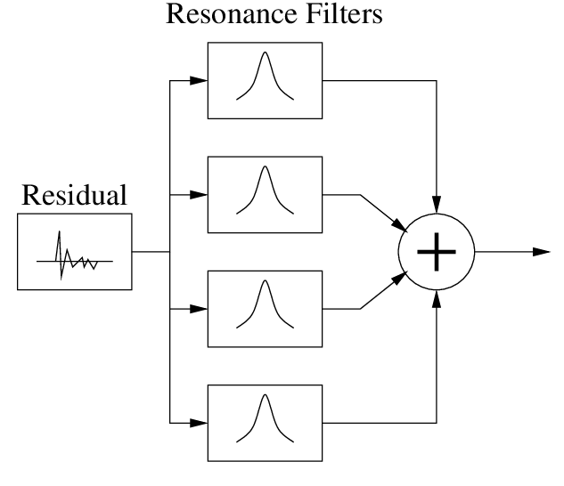
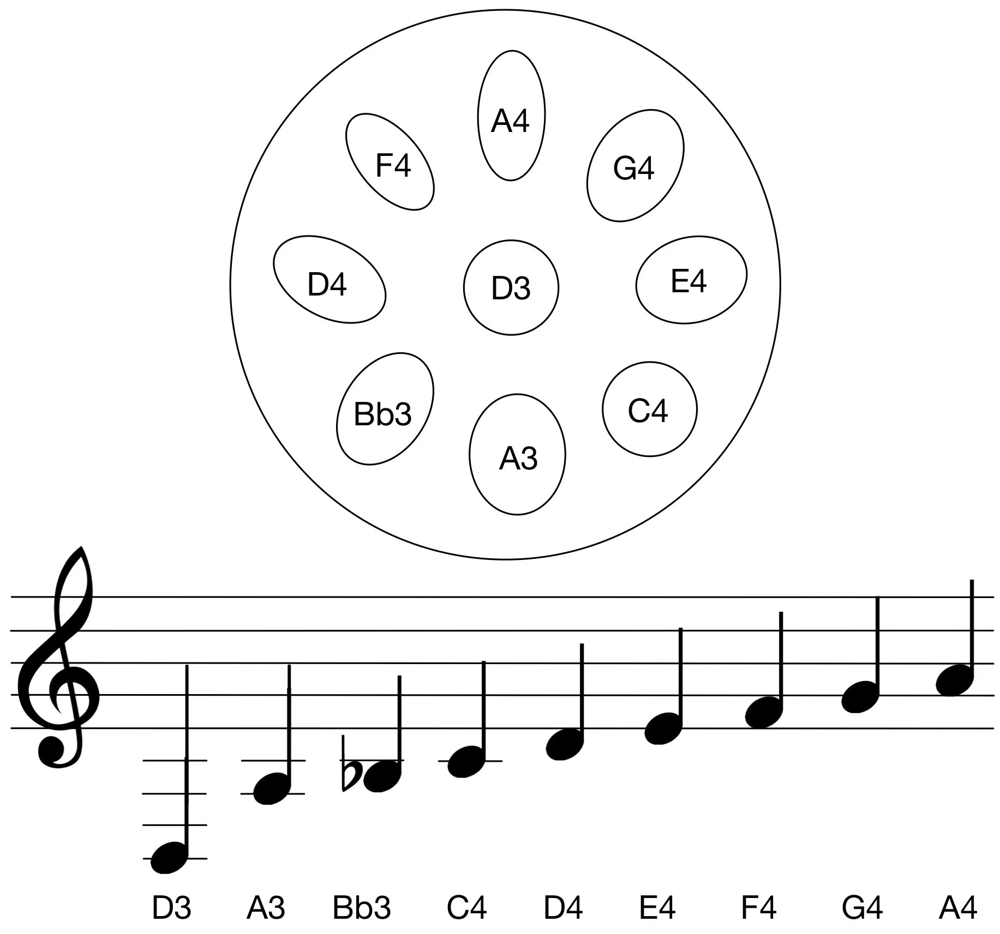
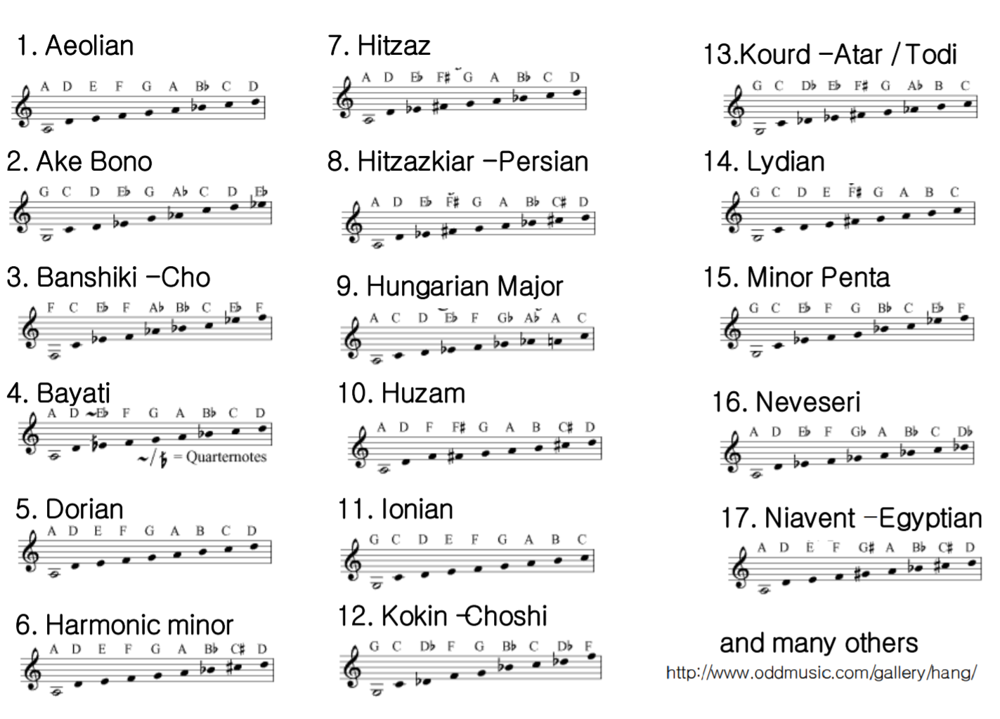
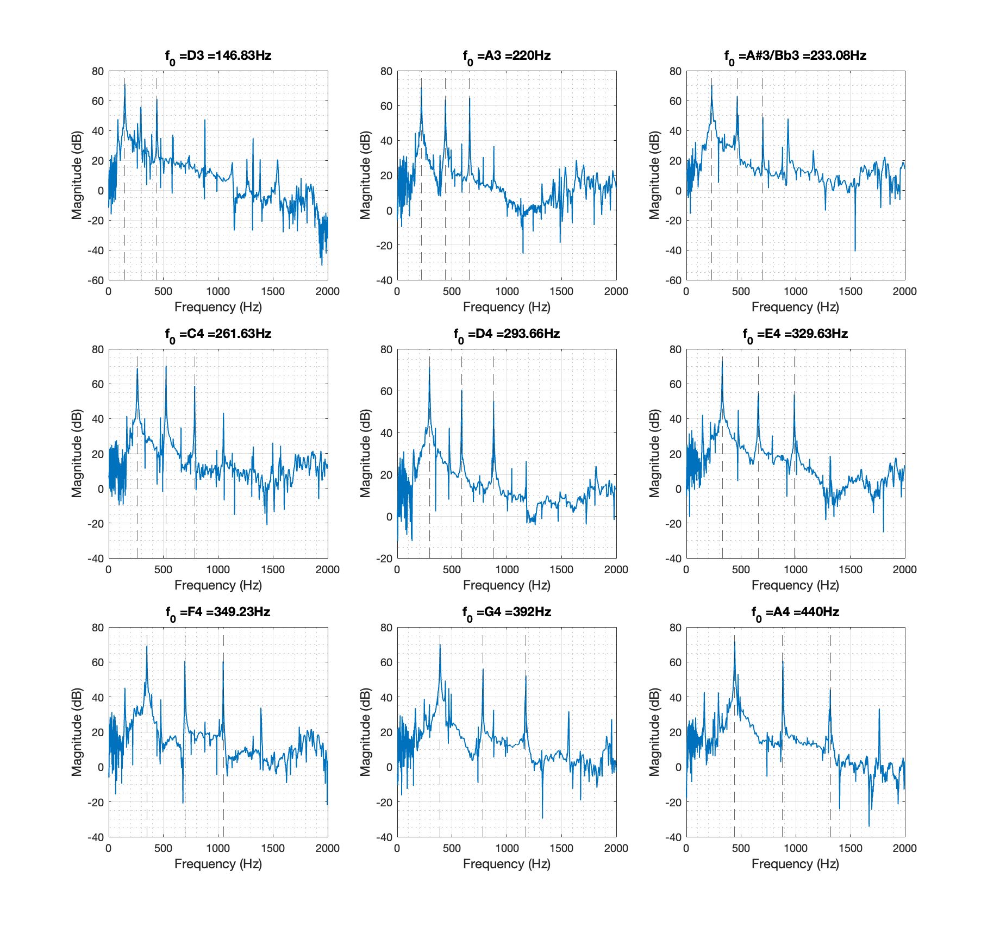
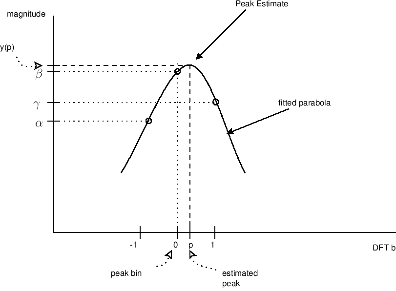
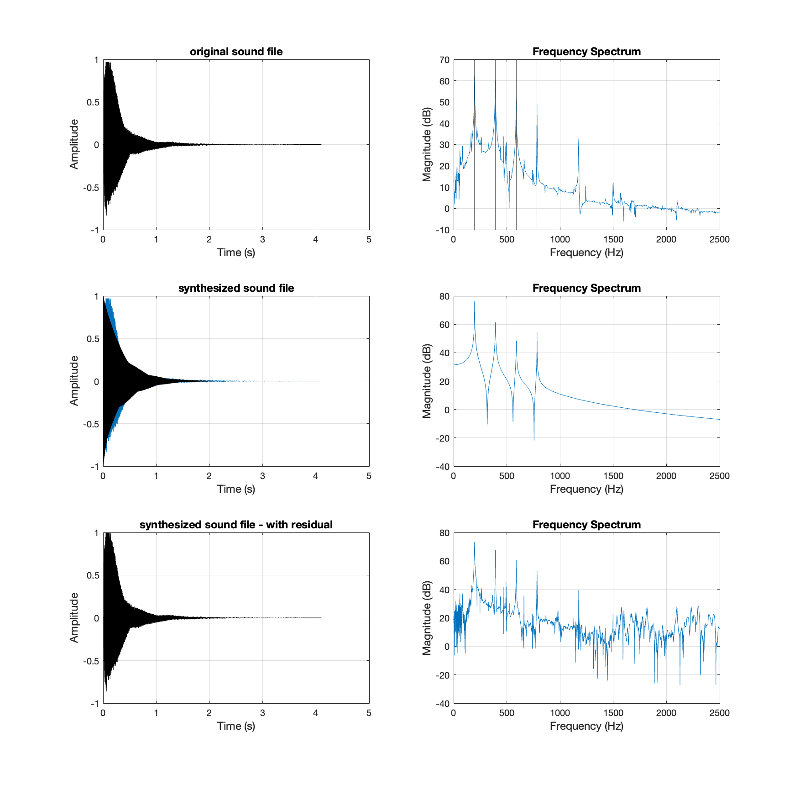

```markdown
Sound synthesis is to generate a signal with desired acoustical effects and can be 

useful in sound design. Some common techniques include additive synthesis, granular 

synthesis, and physical modelling. This project aims to synthesize the handpan sound 

using modal synthesis. The model was devised by extracting the frequency peaks and 

bandwidths of the sound source. Thirteen recorded samples of the impulse response 

of each note were analyzed and recreated with resonance filters designed in MATLAB, 

and a song was played with realistic synthesized sound for demonstration.
```

## Introduction

Physical model synthesis is a technique to simulate the vibrations of objects under various excitations. It requires a description of the vibrational characteristics and the coupling interactions of the physical structures. Modal synthesis can be seen as a special physical modelling technique in which the vibrations of resonant structures are simulated based on a modal representation, and the interactions between structures are calculated by the time step of the corresponding equations [[1](https://doi.org/10.2307/3680569)].

### Modal Synthesis

Modal synthesis is a technique to perform vibration analysis of a system by determining its mode shapes and frequencies. For example, a signal shown in Figure 1 can be seen as a superposition of various modes; each has a particular frequency [[2](https://ccrma.stanford.edu/~bilbao/booktop/node14.html)]. It can be re-assembled by combining such frequencies and selected modal information. Modal synthesis is "both effective and efficient for recreating the sounds of objects that exhibit a relatively small number of strong decaying modes" [[3](https://www.music.mcgill.ca/~gary/307/week10/modal.html)]. Some good candidates for such technique are plucked strings, a marimba struck by a mallet or a bar hit by a hammer. It can also use filter banks (i.e. a lot of filters) to simulate all the resonant modes of the system, as illustrated in Figure 2 [[4](http://www.music.mcgill.ca/~gary/307/week10/node4.html)]. Resonance filters can approximate the spectral and temporal profile of the sound: the radius of the filter, which is related to its bandwidth, gives insights into the decay time.

<p align="center">
  
  <figcaption align = "center"><b>Figure 1. Modal synthesis of a linear, distributed time-dependent signal as decomposition and recombination of individul modes with different frequencies.</b></figcaption>
</p>

<p align="center">
  
  <figcaption align = "center"><b>Figure 2. A block diagram of modal synthesis model using resonance filters.</b></figcaption>
</p>


### Handpan

A handpan instrument is a group of metallic percussion instruments played with hands that are similar to Hang® (cre­at­ed by PANArt tuners Sabi­na Schär­er and Felix Rohn­er in 2000 in Switzer­land [[5](https://panart.ch/en/articles/copyright-questions-and-answers)]), consisting of two hemispherical shells of nitrided or stainless steel. Its extraordinary sound is often described as calming and peaceful, which can be used for stress release [[6](https://theconsciousclub.com/articles/2019/10/24/the-magic-of-the-handpan-the-instrument-for-stress-release-and-harmonynbsp)]. Originated from the Caribbean steelpan instrument, a handpan typically has 8-9 notes on a pentatonic scale. Figure 3 is a sample image of a free integral Hang® built by PANArt, where seven harmonically tuned notes are around a deep central tone, and each excites the Helmholtz resonance in the body of the instrument [[7](http://www.hangblog.org/panart/Paper-Hang-2007.pdf)] [[8](https://commons.wikimedia.org/wiki/File:Panart-freies-integrales-hang.jpg)]. Figure 4 is a sample tuning scale commonly known as Kurd D, adapted from [[9](https://acoustics.org/pressroom/httpdocs/155th/wessel.htm)]. It can be tuned in a wide range of scales; some examples are illustrated in Figure 5 [[10](http://www.hangblog.org/panart/2-S2-4-IsmaRossing.pdf)]. 

<p align="center">
  
  <figcaption align = "center"><b>Figure 3. The side, top, and bottom view of a Hang®.</b></figcaption>
</p>
<p>&nbsp;</p>
<p align="center">
   
  <figcaption align = "center"><b>Figure 4. A sample tuning scale beginning with D3 note in the center. Eight note areas are arranged around the center note area of the handpan.</b></figcaption>
</p>
<p>&nbsp;</p>
<p align="center">
  
  <figcaption align = "center"><b>Figure 5. Sample tuning scales.</b></figcaption>
</p>

The playing technique of a handpan is to strike it with the hand, either using fingertips or the palm. Different manner can considerably influence the quality of the sounds: the spectral content, the decay time, and other features of the amplitude envelope depend on the intensity of the hit [[9](https://acoustics.org/pressroom/httpdocs/155th/wessel.htm)]. Tapping with a rubber mallet or just fingertips on a single note area can excite the fundamental, the second, and the third harmonics, as illustrated in Figure 6. The harmonic ratio of the most prominent spectral peaks is 1 : 2 : 3, and striking one note can also make other notes vibrate [[11](https://doi.org/10.1063/1.3099586)].

<p align="center">
  
  <figcaption align = "center"><b>Figure 6. Sound spectra of each note in a handpan as shown in Figure 4. Each spectrum shows the ratio of harmonic frequencies in 1 : 2 : 3, and some have fourth harmonics. Small peaks in the ratio of 82 Hz (near E2) are also visible in each spectrum, which is the frequency of the cavity resonance.</b></figcaption>
</p>

## Methods

Since each note is impulsively excited, the handpan can be modelled with a bank of resonance filters, and each is centred at particular frequency components. To obtain the parameters (gains and decay times) for these filters, one can tap each note area slightly with one hand or a rubber mallet and record the impulse response. A set of recorded samples are stored on the Github repo [[12](https://github.com/bel0v/handpan)]. Performing FFT (Fast Fourier Transform) on each sample and finding peaks of the spectra gives information on the central frequency and amplitude of each vibration mode. We can then estimate the peak bandwidth at a level of -3 dB to find the pole radius, which relates to the quality factor Q and the decay constant a. The feedback coefficients of a second-order IIR (infinite impulse response) filter can also be calculated to generate an impulse response. Finally, we can excite the impulse response with a residual obtained from the original signal. The detailed procedure with equations is listed below, and the MATLAB script is attached in Appendix A.

### Resonance Filter Bank

In order to simulate a decaying waveform, a digital resonator centred at frequency f can be designed to create an impulse response. This was achieved using second-order IIR filters with feedback coefficients of a1 and a2, with the following specifications [[4](https://www.music.mcgill.ca/~gary/307/week10/node4.html)]:

- difference equation of a second-order filter: y[n] = b0 * x[n] + b1 * x[n - 1] + b2 * x[n - 2] - a1 * y[n - 1] - a2 * y[n - 2], n = 0, 1, 2, ...,
- b0 = peak amplitude,
- a1 = -2 * r * cos(2 * pi * f * Ts), r = pole radius, Ts = sample period = 1/fs
- a2 = r^2,
- r = e^(-pi * B * Ts), B = 3dB-bandwidth [[13](https://ccrma.stanford.edu/~jos/fp/Resonator_Bandwidth_Terms_Pole.html)].

Therefore, we need to extract each peak's frequency and amplitude and find their 3-dB bandwidth.

<!--
- $a_1 = -2 r \cos( 2 \pi f T_s )$
- $a_2 = r^2$
- $ B = - \frac{\ln(R)}{\pi T} $
- $ r = e^{- \pi B T_s}$

- difference equation of a second-order filter: ![y[n] = b0*x[n] + b1*x[n - 1] + b2*x[n - 2] - a1*y[n - 1] - a2*y[n - 2], n = 0, 1, 2, ...,](http://www.sciweavers.org/tex2img.php?eq=y%5Bn%5D%20%3D%20b_0%20x%5Bn%5D%20%2B%20b_1%20x%5Bn%20-%201%5D%20%2B%20b_2%20x%5Bn%20-%202%5D%20-%20a_1%20y%5Bn%20-%201%5D%20-%20a_2%20y%5Bn%20-%202%5D%2C%20n%20%3D%200%2C%201%2C%202%2C%20...&bc=White&fc=Black&im=jpg&fs=12&ff=arev&edit=)
- b0 = peak amplitude,
- , r = pole radius, Ts = sample period = 1/fs
- ,
- , B = 3dB-bandwidth [[13](https://ccrma.stanford.edu/~jos/fp/Resonator_Bandwidth_Terms_Pole.html)].
-->

### Parabolic Interpolation of Spectral Peaks

The frequency resolution of an N-point DFT (Discrete Fourier Transform) is fs/N Hz, where fs is the sampling frequency. Since the peak value is not necessary at the bin value, a parabola was fitted to the spectral data to estimate the peak and amplitude values based on the three samples nearest the peak, as illustrated in Figure 7 [[14](https://ccrma.stanford.edu/~jos/sasp/Quadratic_Interpolation_Spectral_Peaks.html)].

<p align="center">
  
  <figcaption align = "center"><b>Figure 7. Illustration of parabolic interpolation using the three most significant values around a peak.</b></figcaption>
</p>

A parabola can be written as y(x) = a(x-p)^2 + b, in which p is the peak location in bins, b is the peak amplitude in dB, and a is the curvature. The peak location can be extracted from the three nearest samples y(-1) = alpha, y(0) = beta, and y(1) = gamma as:
p = (0.5) * (alpha - gamma) / (alpha - 2 * beta + gamma) = [-1/2, 1/2]. 
Therefore, the estimated peak value y(p) is:
y(p) = beta - 0.25 * (alpha - gamma) * p [[14](https://ccrma.stanford.edu/~jos/sasp/Quadratic_Interpolation_Spectral_Peaks.html)].

<!--
A parabola can be written as , in which p is the peak location in bins, b is the peak amplitude in dB, and a is the curvature. The peak location can be extracted from the three nearest samples y(-1) = , y(0) =  and y(1) =  as ![$p = (0.5) *(\alpha-\gamma) / (\alpha-2*\beta+\gamma) \in [-1/2,1/2]$](http://www.sciweavers.org/tex2img.php?eq=p%3D%5Cfrac%7B1%7D%7B2%7D%5Cfrac%7B%5Calpha-%5Cgamma%7D%7B%5Calpha-2%5Cbeta%2B%5Cgamma%7D%20%5Cin%20%5B-1%2F2%2C1%2F2%5D&bc=White&fc=Black&im=jpg&fs=12&ff=arev&edit=). Therefore, the estimated peak value y(p) is  [[14](https://ccrma.stanford.edu/~jos/sasp/Quadratic_Interpolation_Spectral_Peaks.html)].


<p align="center">
  
  <figcaption align = "center"><b>Figure 7. Illustration of parabolic interpolation using the three most significant values around a peak.</b></figcaption>
</p>
-->

```matlab
%% find peaks of the spectrum using parabolic interpolation
% ref: https://ccrma.stanford.edu/~jos/sasp/Quadratic_Interpolation_Spectral_Peaks.html

Y = abs(Y(1:ceil(N/2))); % keep half of fft
Xi = [];
threshold = 10^(40/20);  % dB converted to linear value
for n = 2:length(Y)-2    % search for peak indices
  if Y(n+1) <= Y(n) && Y(n-1) < Y(n) && Y(n) > threshold
    Xi = [Xi, n];
  end
end

Yi = zeros( size( Xi ) );
for n = 1:length(Xi)
  alpha = Y(Xi(n)-1);
  beta = Y(Xi(n));
  gamma = Y(Xi(n)+1);
  Xii = 0.5 * (alpha - gamma) / (alpha - 2 * beta + gamma); 
  % interpolated bin value (-1/2 to +1/2)
  
  Yi(n) = beta - 0.25 * (alpha - gamma) * Xii; 
  % interpolated peak value
  
  if Xii > 0
    Xi(n) = f(Xi(n)) + Xii*(f(Xi(n)+1)-f(Xi(n))); % bin value in Hz
  else
    Xi(n) = f(Xi(n)) + Xii*(f(Xi(n))-f(Xi(n)-1)); % bin value in Hz
  end
end
```

### 3dB-Bandwidth Estimation

After finding the frequency peaks, their 3dB-bandwidth can be calculated directly from the `powerbw()` function [[15](https://www.mathworks.com/help/signal/ref/powerbw.html)]. The periodogram power spectral density (PSD) was first estimated through the `periodogram()` function, and their 3dB-bandwidth was obtained in each peak by specifying the frequency range [[16](https://www.mathworks.com/help/signal/ref/periodogram.html)].

```matlab
%% find -3dB Bandwidth

[Pxx,f2] = periodogram(y(sigIdx),rectwin(N),[],fs);
for i = 1:length(Xi)
    figure(1)
    xline(Xi(i))
    fl = Xi(i)-10;
    fr = Xi(i)+10;
    bw(i) = powerbw(Pxx(f2>fl & f2 < fr), f2(f2>fl & f2 < fr));
end
bw;
factor = 0.6;
B = factor*bw;
```

### Apply the Filters

Given all the parameters being estimated above, the impulse response of each filter can then be applied with the residual of the original signal to simulate a realistic sound.

```matlab
%% IIR filter parameters

r = exp(-pi*B/fs);
b0 = Yi;
a1 = -2*r.*cos(2*pi*Xi/fs);
a2 = r.^2;

%% Create impulse response of filter bank

N = length(y);
x = [1; zeros(N-1, 1)];
y2 = filter( b0(1), [1 a1(1) a2(1)], x );
for n = 2:K
  y2 = y2 + filter( b0(n), [1 a1(n) a2(n)], x );
end

y1 =  y2 / max(abs(y2));

useResidual = true;
if useResidual
  Y = fft(y);
  Y2 = fft(y2);
  R = Y ./Y2;
  r = 50*real(ifft(R)); 

  y2 = filter( b0(1), [1 a1(1) a2(1)], r );
  for n = 2:K
    y2 = y2 + filter( b0(n), [1 a1(n) a2(n)], r );
  end
end

y2 =  y2 / max(abs(y2));
```

## Results

A total of 13 recorded samples were obtained and simulated via modal synthesis with resonance filters, as listed below (click the play button). In addition, the time and frequency domain of each signal was plotted, and an example of note G3 is illustrated in Figure 8.

The recorded sample of Note D3: 
<audio controls="controls" src="./sounds-original/s0-d2.mp3">
<p>Note D3 - original.</p>
</audio>

The impulse response of resonance filters of Note D3 (no residual): 
<audio controls="controls" src="./sounds-modalSynth/s0-d2-noRes.wav">
<p>Note D3 - filter's impulse response.</p>
</audio>

The synthesized Note D3 excited by residual: 
<audio controls="controls" src="./sounds-modalSynth/s0-d2.wav">
<p>Note D3 - recreated.</p>
</audio>

***

The recorded sample of Note G3: 
<audio controls="controls" src="./sounds-original/s1-G3.mp3">
<p>Note G3 - original.</p>
</audio>

The impulse response of resonance filters of Note G3 (no residual): 
<audio controls="controls" src="./sounds-modalSynth/s1-G3-noRes.wav">
<p>Note G3 - filter's impulse response.</p>
</audio>

The synthesized Note G3 excited by residual: 
<audio controls="controls" src="./sounds-modalSynth/s1-G3.wav">
<p>Note G3 - recreated.</p>
</audio>

<p align="center">
  
  <figcaption align = "center"><b>Figure 8. Time and frequency spectra of note G3. The orginal sound file, the impulse response of the resonance filters, and the synthesized sound driven by the residual were demostrated.</b></figcaption>
</p>

***

The recorded sample of Note A3: 
<audio controls="controls" src="./sounds-original/s3-A3.mp3">
<p>Note A3 - original.</p>
</audio>

The impulse response of resonance filters of Note A3 (no residual): 
<audio controls="controls" src="./sounds-modalSynth/s3-A3-noRes.wav">
<p>Note A3 - filter's impulse response.</p>
</audio>

The synthesized Note A3 excited by residual: 
<audio controls="controls" src="./sounds-modalSynth/s3-A3.wav">
<p>Note A3 - recreated.</p>
</audio>

***

The recorded sample of Note Bb3: 
<audio controls="controls" src="./sounds-original/s4-Bb3.mp3">
<p>Note Bb3 - original.</p>
</audio>

The impulse response of resonance filters of Note Bb3 (no residual): 
<audio controls="controls" src="./sounds-modalSynth/s4-Bb3-noRes.wav">
<p>Note Bb3 - filter's impulse response.</p>
</audio>

The synthesized Note Bb3 excited by residual: 
<audio controls="controls" src="./sounds-modalSynth/s4-Bb3.wav">
<p>Note Bb3 - recreated.</p>
</audio>

***

The recorded sample of Note B3: 
<audio controls="controls" src="./sounds-original/s5-B3.mp3">
<p>Note B3 - original.</p>
</audio>

The impulse response of resonance filters of Note B3 (no residual): 
<audio controls="controls" src="./sounds-modalSynth/s5-B3-noRes.wav">
<p>Note B3 - filter's impulse response.</p>
</audio>

The synthesized Note B3 excited by residual: 
<audio controls="controls" src="./sounds-modalSynth/s5-B3.wav">
<p>Note B3 - recreated.</p>
</audio>

***

The recorded sample of Note C4: 
<audio controls="controls" src="./sounds-original/s6-C4.mp3">
<p>Note C4 - original.</p>
</audio>

The impulse response of resonance filters of Note C4 (no residual): 
<audio controls="controls" src="./sounds-modalSynth/s6-C4-noRes.wav">
<p>Note C4 - filter's impulse response.</p>
</audio>

The synthesized Note C4 excited by residual: 
<audio controls="controls" src="./sounds-modalSynth/s6-C4.wav">
<p>Note C4 - recreated.</p>
</audio>

***

The recorded sample of Note D4: 
<audio controls="controls" src="./sounds-original/s8-D4.mp3">
<p>Note D4 - original.</p>
</audio>

The impulse response of resonance filters of Note D4 (no residual): 
<audio controls="controls" src="./sounds-modalSynth/s8-D4-noRes.wav">
<p>Note D4 - filter's impulse response.</p>
</audio>

The synthesized Note D4 excited by residual: 
<audio controls="controls" src="./sounds-modalSynth/s8-D4.wav">
<p>Note D4 - recreated.</p>
</audio>

***

The recorded sample of Note E4: 
<audio controls="controls" src="./sounds-original/s10-E4.mp3">
<p>Note E4 - original.</p>
</audio>

The impulse response of resonance filters of Note E4 (no residual): 
<audio controls="controls" src="./sounds-modalSynth/s10-E4-noRes.wav">
<p>Note E4 - filter's impulse response.</p>
</audio>

The synthesized Note E4 excited by residual: 
<audio controls="controls" src="./sounds-modalSynth/s10-E4.wav">
<p>Note E4 - recreated.</p>
</audio>

***

The recorded sample of Note F4: 
<audio controls="controls" src="./sounds-original/s11-F4.mp3">
<p>Note F4 - original.</p>
</audio>

The impulse response of resonance filters of Note F4 (no residual): 
<audio controls="controls" src="./sounds-modalSynth/s11-F4-noRes.wav">
<p>Note F4 - filter's impulse response.</p>
</audio>

The synthesized Note F4 excited by residual: 
<audio controls="controls" src="./sounds-modalSynth/s11-F4.wav">
<p>Note F4 - recreated.</p>
</audio>

***

The recorded sample of Note Gb4: 
<audio controls="controls" src="./sounds-original/s12-Gb4.mp3">
<p>Note Gb4 - original.</p>
</audio>

The impulse response of resonance filters of Note Gb4 (no residual): 
<audio controls="controls" src="./sounds-modalSynth/s12-Gb4-noRes.wav">
<p>Note Gb4 - filter's impulse response.</p>
</audio>

The synthesized Note Gb4 excited by residual: 
<audio controls="controls" src="./sounds-modalSynth/s12-Gb4.wav">
<p>Note Gb4 - recreated.</p>
</audio>

***

The recorded sample of Note G4: 
<audio controls="controls" src="./sounds-original/s13-G4.mp3">
<p>Note G4 - original.</p>
</audio>

The impulse response of resonance filters of Note G4 (no residual): 
<audio controls="controls" src="./sounds-modalSynth/s13-G4-noRes.wav">
<p>Note G4 - filter's impulse response.</p>
</audio>

The synthesized Note G4 excited by residual: 
<audio controls="controls" src="./sounds-modalSynth/s13-G4.wav">
<p>Note G4 - recreated.</p>
</audio>

***

The recorded sample of Note A4: 
<audio controls="controls" src="./sounds-original/s15-A4.mp3">
<p>Note A4 - original.</p>
</audio>

The impulse response of resonance filters of Note A4 (no residual): 
<audio controls="controls" src="./sounds-modalSynth/s15-A4-noRes.wav">
<p>Note A4 - filter's impulse response.</p>
</audio>

The synthesized Note A4 excited by residual: 
<audio controls="controls" src="./sounds-modalSynth/s15-A4.wav">
<p>Note A4 - recreated.</p>
</audio>

***

The recorded sample of Note B4: 
<audio controls="controls" src="./sounds-original/s16-B4.mp3">
<p>Note B4 - original.</p>
</audio>

The impulse response of resonance filters of Note B4 (no residual): 
<audio controls="controls" src="./sounds-modalSynth/s16-B4-noRes.wav">
<p>Note B4 - filter's impulse response.</p>
</audio>

The synthesized Note B4 excited by residual: 
<audio controls="controls" src="./sounds-modalSynth/s16-B4.wav">
<p>Note B4 - recreated.</p>
</audio>

<!---
[recorded sample](./sounds-original/s0-d2.mp3)
https://talk.commonmark.org/t/embedded-audio-file-from-github-repo/3558
-->
***

A song [Yan Yu Qing Dai](https://www.youtube.com/watch?v=PhtP8YuxzAQ) [烟雨青黛](https://www.ximalaya.com/yinyue/14671846/80535737) written by Chinese musician Shi, Lei was also recreated with synthesized sounds:
<audio controls="controls" src="./YanYuQingDai.m4a">
<p>YanYuQingDai.</p>
</audio>

## Discussion

The synthesized handpan sound is very realistic, and one can barely distinguish it from the recorded sample. The frequency spectrum of each note was analyzed to find peaks in frequency and amplitude, and the bandwidth was successfully obtained from the MATLAB functions. Modal synthesis provides a simple and efficient solution to synthesize this type of metallic percussion instrument. So it can be applied to other impulsively excited objects. One of the challenges was to obtain the clean recorded samples of the impulse response of each note, as no handpan was available on hand. Most online recordings have multiple notes playing successively or simultaneously, or only one or two impulse responses from the same handpan were published. Some tapes are noisy, and the results would not be ideal as the noise could also be synthesized. Removing noise would lose some of the spectral content of the sound. Luckily, a set of relatively clean recorded samples was found on a GitHub repo.

If one wants to record the impulse response by themselves, the experimental set-up can be found in Eyal Alon's master's thesis, "[Analysis and Synthesis of the Handpan Sound](https://etheses.whiterose.ac.uk/12260/1/EyalMSc.pdf)", which details the recording procedure, analysis and synthesis of handpan sound.

Another challenge was to adjust the bandwidth. If one uses the bandwidth obtained directly from the  `powerbw()` built-in function in MATLAB, the decay time would be too long or too short, resulting in an undesired sound. Therefore, a fudge factor was applied to the bandwidth to adjust the values. Each note has a different fudge factor, and the effect can be visualized by looking at the time domain of the impulse response of the resonance filters.

Moreover, if the impulse response were not excited by the residual from the original sample, the synthesized sound would not be so realistic; it is more soft and artificial, as one can hear from the recordings in the Results section.


## Conclusion

The handpan sound was successfully recreated with the modal synthesis technique using resonance filters, and a song was generated using the synthesized sound. It provides a simple yet efficient way to simulate impulse responses of objects. The model can be expanded to every handpan sound or other instrument. Then it can be fed into a computer program (such as Max/MSP, Ariduino IDE, etc.) to simulate a real handpan on a physical model. One example would be the [Mini Handpan](https://carrieeex.github.io/MUMT306-project/) project I did last year for MUMT 306. Another implementation is to build a virtual model as it exists [here](https://www.haganenote.com/vst/handpan-virtual-instrument.html). This virtual handpan is ideal for practice and choosing the desired scale before buying, as a physical handpan is expensive and heavy.

***

## References

[1]: Morrison, Joseph Derek, and Jean-Marie Adrien. "MOSAIC: A Framework for Modal Synthesis." Computer Music Journal 17, no. 1 (1993): 45–56. https://doi.org/10.2307/3680569.

[2]: Bilbao, Stefan. "Modal Synthesis", in _Numerical Sound Synthesis_, https://ccrma.stanford.edu/~bilbao/booktop/node14.html, online book, 2006 edition, accessed 22 April 2022.

[3]: Scavone, Gary P. "Modal Synthesis", in _MUMT 307: Music Audio Computing II_, https://www.music.mcgill.ca/~gary/307/week10/modal.html, online book, 2022 edition, accessed 22 April 2022.

[4]: Scavone, Gary P. "Digital 'Resonators'", in _MUMT 307: Music Audio Computing II_, http://www.music.mcgill.ca/~gary/307/week10/node4.html, online book, 2022 edition, accessed 22 April 2022.

[5]: PANArt. "Copyright: Questions and Answers". Panart (en). Accessed 22 April 2022. https://panart.ch/en/articles/copyright-questions-and-answers.

[6]: Malzer, Clara. "The Magic of The Handpan: The Instrument For Stress-Release And Harmony". The Conscious Club. Accessed 22 April 2022. https://theconsciousclub.com/articles/2019/10/24/the-magic-of-the-handpan-the-instrument-for-stress-release-and-harmonynbsp.

[7]: Rohner, Felix, and Sabina Schärer. "History, Development and Tuning of the Hang", 2007. http://www.hangblog.org/panart/Paper-Hang-2007.pdf.

[8]: "File:Panart-Freies-Integrales-Hang.Jpg - Wikipedia". Accessed 22 April 2022. https://commons.wikimedia.org/wiki/File:Panart-freies-integrales-hang.jpg.

[9]: Wessel, David, Andrew Morrision, and Thomas D. Rossing. "SOUND OF THE HANG". ACOUSTICS.ORG, 4 July 2008. https://acoustics.org/pressroom/httpdocs/155th/wessel.htm.

[10]: Rossing, Thomas D., Andrew Morrision, Uwe Hansen, Felix Rohner, and Sabina Schärer. "ACOUSTICS OF THE HANG: A Hand-Played Steel Instrument", 2007. http://www.hangblog.org/panart/2-S2-4-IsmaRossing.pdf.

[11]: Morrison, Andrew, and Thomas D. Rossing. "The Extraordinary Sound of the Hang". Physics Today 62, no. 3 (March 2009): 66–67. https://doi.org/10.1063/1.3099586.

[12]: Yegor. Bel0v/Handpan. JavaScript, 2016. Accessed 22 April 2022. https://github.com/bel0v/handpan.

[13]: Smith, J.O. "Resonator Bandwidth in Terms of Pole Radius", in _Introduction to Digital Filters with Audio Applications_, https://ccrma.stanford.edu/~jos/fp/Resonator_Bandwidth_Terms_Pole.html, online book, 2007 edition, accessed 22 April 2022.

[14]: Smith, J.O. "Quadratic Interpolation of Spectral Peaks", in _Spectral Audio Signal Processing_, https://ccrma.stanford.edu/~jos/sasp/Quadratic_Interpolation_Spectral_Peaks.html, online book, 2011 edition, accessed 22 April 2022.

[15]: "Power Bandwidth - MATLAB Powerbw." Accessed April 22, 2022. https://www.mathworks.com/help/signal/ref/powerbw.html.

[16]: "Periodogram Power Spectral Density Estimate - MATLAB Periodogram." Accessed April 22, 2022. https://www.mathworks.com/help/signal/ref/periodogram.html.

## Appendix 

### A. Sample MATLAB script of Modal Synthesis.

```MATLAB
% A Matlab script to demonstrate modal synthesis, based on course materials
% from MUMT 307 at McGill University by Professor Gary P. Scavone.

clear all; close all; %clc

prompt = "The sound file to synthesize: ";

txt = input(prompt,"s");
fileLoc = 'sounds-original/';
ext = '.mp3';
if isempty(txt)
    s_original = strcat(fileLoc,'s1-G3',ext);
else
    s_original = strcat(fileLoc,txt,ext);
end

[y, fs] = audioread( s_original );

fs;                             % sampling rate = 44100 Hz
T = 1/fs;                       % sampling period
N = length(y);                  % number of samples in the sound file
Ttot = N./fs;                   % duration in seconds
t = 0: Ttot/N : Ttot-Ttot/N;    % time sequence

figure(1);
subplot(3, 2, 1)
plot( t, y, 'k' )
xlabel('Time (s)');
ylabel('Amplitude');
title('original sound file');
grid on

N = 2^14;                       % length of FFT 
iStart = 10^4;                  % starting sample of the FFT
sigIdx = iStart:N+iStart-1;     % index of the FFT
Y = fft(y(sigIdx));             % FFT

subplot(3, 2, 2)
f = (0:N-1)*fs/N;
plot(f, 20*log10(abs(Y)))
xlim([0 5000/2])
grid
xlabel('Frequency (Hz)')
ylabel('Magnitude (dB)')
title('Frequency Spectrum');

%% find peaks of the spectrum using parabolic interpolation
% ref: https://ccrma.stanford.edu/~jos/sasp/Quadratic_Interpolation_Spectral_Peaks.html

Y = abs(Y(1:ceil(N/2))); % keep half of fft
Xi = [];
threshold = 10^(40/20);  % dB converted to linear value
for n = 2:length(Y)-2    % search for peak indices
  if Y(n+1) <= Y(n) && Y(n-1) < Y(n) && Y(n) > threshold
    Xi = [Xi, n];
  end
end

Yi = zeros( size( Xi ) );
for n = 1:length(Xi)
  alpha = Y(Xi(n)-1);
  beta = Y(Xi(n));
  gamma = Y(Xi(n)+1);
  Xii = 0.5 * (alpha - gamma) / (alpha - 2 * beta + gamma); 
  % interpolated bin value (-1/2 to +1/2)
  
  Yi(n) = beta - 0.25 * (alpha - gamma) * Xii; 
  % interpolated peak value
  
  if Xii > 0
    Xi(n) = f(Xi(n)) + Xii*(f(Xi(n)+1)-f(Xi(n))); % bin value in Hz
  else
    Xi(n) = f(Xi(n)) + Xii*(f(Xi(n))-f(Xi(n)-1)); % bin value in Hz
  end
end

K = length(Xi);
Xi = Xi(1:K);
Yi = Yi(1:K);

%% find -3dB Bandwidth

[Pxx,f2] = periodogram(y(sigIdx),rectwin(N),[],fs);
for i = 1:length(Xi)
    figure(1)
    xline(Xi(i))
    fl = Xi(i)-10;
    fr = Xi(i)+10;
    bw(i) = powerbw(Pxx(f2>fl & f2 < fr), f2(f2>fl & f2 < fr));
end
bw;
factor = 0.6;
B = factor*bw;

%% IIR filter parameters

r = exp(-pi*B/fs);
b0 = Yi;
a1 = -2*r.*cos(2*pi*Xi/fs);
a2 = r.^2;

%% Create impulse response of filter bank

N = length(y);
x = [1; zeros(N-1, 1)];
y2 = filter( b0(1), [1 a1(1) a2(1)], x );
for n = 2:K
  y2 = y2 + filter( b0(n), [1 a1(n) a2(n)], x );
end

y1 =  y2 / max(abs(y2));

useResidual = true;
if useResidual
  Y = fft(y);
  Y2 = fft(y2);
  R = Y ./Y2;
  r = 50*real(ifft(R)); 

  y2 = filter( b0(1), [1 a1(1) a2(1)], r );
  for n = 2:K
    y2 = y2 + filter( b0(n), [1 a1(n) a2(n)], r );
  end
end

y2 =  y2 / max(abs(y2));

%% play the sound - original, synthesized, and with residual
sound([y; zeros(10000, 1); y1; zeros(10000, 1); y2], fs)

N2 = length(y2);           % number of samples in the sound file
Ttot2 = N2./fs;            % duration in seconds
t2 = 0: Ttot2/N2 : Ttot2-Ttot2/N2;    % time sequence

figure(1);
subplot(3, 2, 5)
plot(t, y)
hold on
plot( t2, y2, 'k' )
xlabel('Time (s)');
ylabel('Amplitude');
title('synthesized sound file - with residual');
grid on

Y2 = fft(y2);
Y2 = abs(Y2(1:ceil(N2/2)));

YdB2 = 20*log10(Y2);

freqs2 = (1:N2-1) * fs/N2; 
freqs2 = freqs2(1:ceil(N2/2));

subplot(3, 2, 6)
plot(freqs2,YdB2)
xlim([0 2500])
xlabel('Frequency (Hz)');
ylabel('Magnitude (dB)');
title('Frequency Spectrum');
grid on

subplot(3, 2, 3)
plot(t, y)
hold on
plot( t2, y1, 'k' )
xlabel('Time (s)');
ylabel('Amplitude');
title('synthesized sound file');
grid on

Y1 = fft(y1);
Y1 = abs(Y1(1:ceil(N2/2)));

YdB1 = 20*log10(Y1);

freqs2 = (1:N2-1) * fs/N2; 
freqs2 = freqs2(1:ceil(N2/2));

subplot(3, 2, 4)
plot(freqs2,YdB1)
xlim([0 2500])
xlabel('Frequency (Hz)');
ylabel('Magnitude (dB)');
title('Frequency Spectrum');
grid on

%% store the file

fileLoc2 = 'sounds-modalSynth/';
ext2 = '.wav';
noRes = '-noRes';

if isempty(txt)
    s_new = strcat(fileLoc2,'s1-G3',ext2);
    s_new1 = strcat(fileLoc2,'s1-G3',noRes,ext2);
else
    s_new = strcat(fileLoc2,txt,ext2);
    s_new1 = strcat(fileLoc2,txt,noRes,ext2);
end

audiowrite(s_new1, y1, fs)

audiowrite(s_new, y2, fs)
```

